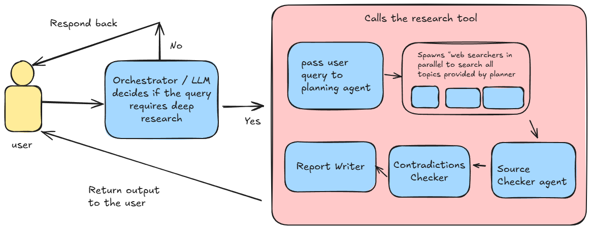

# Deep Research AI

This project is a powerful AI-powered research agent that performs in-depth research on any given topic. It uses a multi-agent approach to plan, search, verify, and generate comprehensive research reports.

## Architecture

The architecture of the Deep Research Agent is designed to be modular and efficient. It consists of several specialized agents that work together to deliver high-quality research results.


_Project Architecture_

### Workflow

1.  **Query Analysis:** The user provides a research query. The Orchestrator agent, powered by a Large Language Model (LLM), analyzes the query to determine if it requires a deep research process.
2.  **Planning:** If deep research is needed, the query is passed to the Planning agent. This agent breaks down the main topic into smaller, manageable sub-topics for research.
3.  **Parallel Searching:** The system spawns multiple "web searcher" agents that run in parallel to gather information on all the sub-topics identified by the planner.
4.  **Source Verification:** The Source Checker agent verifies the credibility of the information gathered from different sources.
5.  **Contradiction Detection:** The Contradictions Checker agent cross-references the information to identify and resolve any conflicting data.
6.  **Report Generation:** The Report Writer agent consolidates the verified and consistent information into a well-structured and comprehensive research report.
7.  **Output:** The final report is presented to the user.

## Getting Started

### Prerequisites

- Python 3.9+
- uv for package management

### Installation

1. **Clone the repository:**

   ```bash
   git clone https://github.com/your-username/your-repository-name.git
   cd your-repository-name
   ```

2. **Install the dependencies:**
   ```bash
   pip install -r requirements.txt
   ```

### Running the Application

To run the research agent, use the following command:

```bash
chainlit run deep_research_agent.py -w
```

This will start the Chainlit server, and you can interact with the agent through your web browser.
